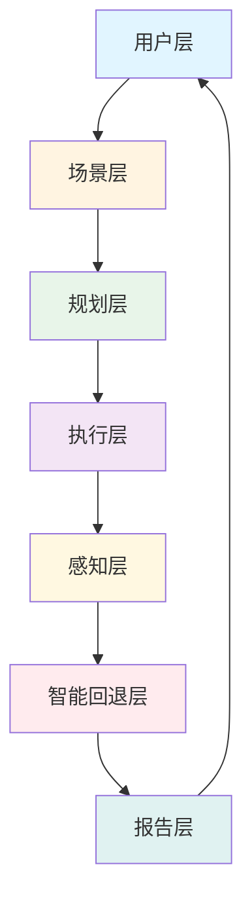
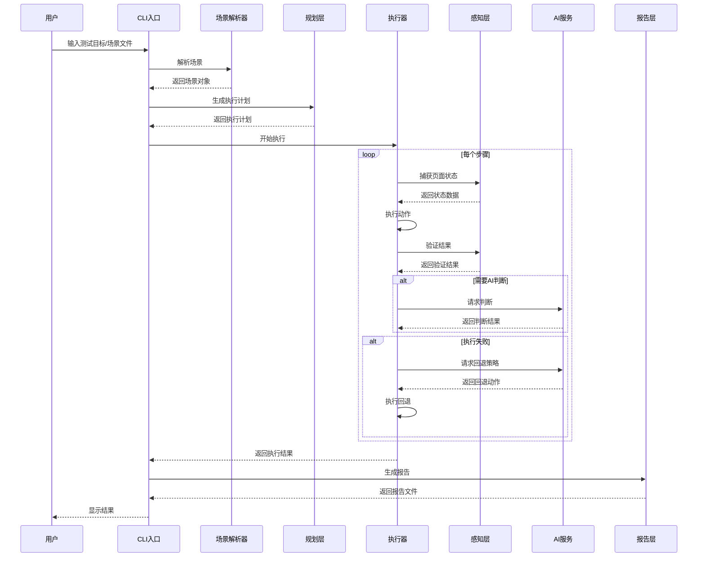
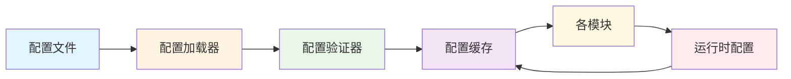

# AI 自动化测试技术架构设计

## 概述

本文档基于项目需求和选型结论，设计 AI 自动化测试系统的技术架构，包括总体架构、各层设计、技术栈选型和实施方案。

## 总体架构

### 混合架构模式

推荐采用：**文件化场景 + 最小确定性执行器 + AI 规划与回退 + 统一报告系统**

这不是纯脚本方案，也不是纯 Agent 黑盒方案，而是一个混合架构。

### 六层架构设计



### 各层职责

#### 1. 用户层

**职责**
- 提供多种交互入口
- 支持不同角色的使用需求

**入口类型**
- CLI 命令行工具
- Web 控制台
- IDE / MCP 集成
- 一键脚本

#### 2. 场景层

**职责**
- 负责描述"要测什么"
- 作为团队共享资产形态

**资产形态**
- Markdown 场景文件
- YAML / JSON 场景文件
- 内含目标、步骤、断言、环境要求和输出要求

**设计理由**
- 满足"像脚本一样读取文件自动执行"
- 让场景可 review、可版本化、可复用
- 降低对 prompt 临时发挥的依赖

**场景文件格式示例**

```yaml
name: 登录并创建仓库
mode: ai_assisted
target: http://localhost:3000
preconditions:
  - 已启动本地服务
  - 使用测试账号
steps:
  - action: open
    value: /
  - action: login
    value:
      username: test_user
      password: secret
  - action: click_text
    value: 新建仓库
  - action: fill_form
    value:
      repo_name: ai-test-demo
assertions:
  - type: text_visible
    value: 仓库创建成功
  - type: screenshot_contains
    value: ai-test-demo
outputs:
  - markdown_report
  - json_report
  - screenshots
```

#### 3. 规划层

**职责**
- 负责把场景转成执行计划

**AI 完成的部分**
- 解析自然语言目标
- 拆解执行步骤
- 把模糊描述转成结构化子任务
- 在执行失败后调整下一步计划

**设计要点**
- 核心不是"让模型写完整脚本"，而是让模型做任务编排与异常回退
- 支持多种执行模式的切换

#### 4. 执行层

**职责**
- 负责稳定执行基础动作

**最小执行器封装的高频稳定能力**
- 打开页面
- 点击
- 输入
- 等待元素出现 / 页面加载
- 切换标签页
- 截图
- 获取控制台日志
- 获取网络请求摘要
- 文件上传下载

**底层推荐**
- 浏览器操作以 Playwright 为稳定底座
- AI 调度接口可以兼容 MCP / browser-use 风格能力

**选择理由**
- Playwright 够稳
- 团队已有相关认知
- 可保留结构化控制能力
- 方便后续做 trace、视频、日志采集

#### 5. 感知层

**职责**
- 让系统不仅"操作"，还能"观察"

**包含的能力**
- 页面截图
- DOM 摘要
- 元素文本
- 控制台错误
- 网络请求结果
- 视觉 OCR

**设计意义**
- 这层是 AI 能做视觉判断、模糊匹配和问题发现的基础

#### 6. 智能回退层

**职责**
- 在执行失败时不立即中断

**可交给 AI 的回退动作**
- 元素未找到时改用视觉定位或文本定位
- 断言失败时补充截图与环境信息
- OCR 失败时切换多模态识别
- 页面跳转异常时尝试重新导航或回退

**必须设置的边界**
- 最大重试次数
- 最大 token 消耗
- 允许的工具列表
- 是否允许修改本地环境

#### 7. 报告层

**职责**
- 把执行结果变成可信交付

**输出两种报告**
- 结构化报告：JSON
- 面向阅读的报告：Markdown / HTML

**核心字段**
- 场景名称
- 执行时间
- 每一步的动作、预期、实际
- 截图和证据链接
- 失败原因
- 问题分类
- 最终结论

## 执行模式设计

### 三种执行模式

#### 模式 1：确定性模式

**特点**
- 只执行结构化步骤
- 不调用 AI 做大范围重规划
- 适合高频稳定回归场景

**适合场景**
- 登录
- 创建仓库
- 表单提交
- 基础 CRUD

**优势**
- 执行速度快
- 结果稳定可靠
- 成本低

#### 模式 2：AI 辅助模式

**特点**
- 基础动作由执行器完成
- 视觉判断、模糊对象匹配和失败分析交给 AI
- 适合页面变化较频繁但仍有主流程约束的场景

**适合场景**
- 页面结构常改
- 需要视觉校验
- 需要更丰富的错误描述

**优势**
- 平衡了稳定性和灵活性
- 成本可控

#### 模式 3：AI 探索模式

**特点**
- 由 AI 根据目标自主探索
- 成本和波动最大
- 更适合问题发现而不是稳定回归

**适合场景**
- 新页面初测
- 探索式测试
- 快速验证未沉淀为正式场景的功能

**优势**
- 适应性最强
- 能发现意外问题

### 模式选择策略

```python
def select_execution_mode(scenario):
    if scenario.is_stable and scenario.is_high_frequency:
        return "deterministic"
    elif scenario.need_visual_validation or scenario.structure_changes_frequently:
        return "ai_assisted"
    elif scenario.is_exploratory or scenario.is_unvalidated:
        return "ai_exploratory"
    else:
        return "ai_assisted"  # 默认模式
```

## 技术栈选型

### 本地 Runner

**选择**
- Node.js / TypeScript
- CLI 入口
- 一键安装脚本
- 环境检查脚本

**理由**
- 团队当前语境更接近前端和脚本体系
- 本地安装、日志采集和 Playwright 集成更顺手

### 浏览器执行器

**选择**
- Playwright

**理由**
- 稳定
- 工具链成熟
- 支持截图、trace、视频、网络、控制台采集

### AI 接入层

**选择**
- 统一 LLM 接口抽象
- 支持云模型和本地模型切换
- 记录 token 消耗

**理由**
- 方便后续做成本控制
- 降低模型供应商绑定

### AI Agent 适配层

**选择**
- 可兼容 `browser-use` 风格任务编排
- 预留 MCP Server / Client 入口

**理由**
- 便于后续接 Claude / Cursor / IDE
- 不必现在就深绑定某一个上层产品

### 报告存储

**选择**
- 本地文件夹输出
- Markdown / HTML
- JSON 原始数据
- 截图与 trace 同目录

**理由**
- 便于当前阶段最小闭环
- 无需先做数据库和平台

## 工程目录结构

### 推荐目录组织

```text
ai-test-runner/
  scenarios/              # 场景文件
    login-create-repo.yml
    pr-workflow.yml
    devcontainer-test.yml
  prompts/               # AI 提示词模板
    planning.md
    report_generation.md
    issue_classification.md
  skills/               # 高频动作封装
    login.js
    create_repo.js
    submit_pr.js
  runner/               # 主执行逻辑
    executor.js
    scenario_parser.js
    result_collector.js
  adapters/             # 适配器
    playwright_adapter.js
    llm_adapter.js
    mcp_adapter.js
    browser_use_adapter.js
  reports/              # 运行输出
    2026-04-23/
      login-test/
        report.md
        report.json
        screenshots/
        trace/
  scripts/              # 安装和工具脚本
    install.sh
    doctor.sh
    run_test.sh
  config/               # 配置文件
    default.config.json
    environments/
  tests/                # 测试文件
    unit/
    integration/
  docs/                 # 文档
    README.md
    ARCHITECTURE.md
    API.md
```

### 各目录职责

- `scenarios/`：场景文件，支持 YAML、JSON、Markdown 格式
- `prompts/`：AI 规划、报告、问题归类 prompt 模板
- `skills/`：高频动作封装，可复用的原子操作
- `runner/`：主执行逻辑，包含场景解析、执行编排、结果收集
- `adapters/`：各种外部工具的适配层，保持核心逻辑与具体实现解耦
- `reports/`：运行输出，按日期组织，每个测试生成独立目录
- `scripts/`：安装、自检、一键运行等辅助脚本
- `config/`：配置文件，支持不同环境的配置
- `tests/`：单元测试和集成测试
- `docs/`：项目文档

## 核心模块设计

### 1. 场景解析器

**职责**
- 读取和解析场景文件
- 验证场景格式和完整性
- 提取场景元数据和执行参数

**接口设计**

```typescript
interface ScenarioParser {
  parse(filePath: string): Promise<Scenario>;
  validate(scenario: Scenario): ValidationResult;
  getMetadata(scenario: Scenario): ScenarioMetadata;
}

interface Scenario {
  name: string;
  mode: ExecutionMode;
  target: string;
  preconditions: string[];
  steps: Step[];
  assertions: Assertion[];
  outputs: OutputType[];
}

interface Step {
  action: string;
  value: any;
  options?: Record<string, any>;
}
```

### 2. 执行编排器

**职责**
- 根据场景生成执行计划
- 协调各层组件执行测试
- 处理执行过程中的异常和回退

**接口设计**

```typescript
interface ExecutionOrchestrator {
  plan(scenario: Scenario): ExecutionPlan;
  execute(plan: ExecutionPlan): Promise<ExecutionResult>;
  handleFailure(failure: ExecutionFailure): Promise<RecoveryAction>;
}

interface ExecutionPlan {
  steps: PlannedStep[];
  fallbackStrategies: FallbackStrategy[];
  checkpoints: Checkpoint[];
}
```

### 3. 执行器管理器

**职责**
- 管理各种执行器实例
- 根据步骤类型选择合适的执行器
- 提供统一的执行接口

**接口设计**

```typescript
interface ExecutorManager {
  registerExecutor(type: string, executor: Executor): void;
  executeStep(step: Step): Promise<StepResult>;
  getExecutor(type: string): Executor;
}

interface Executor {
  execute(step: Step): Promise<StepResult>;
  canHandle(step: Step): boolean;
}
```

### 4. 感知管理器

**职责**
- 协调各种感知能力的调用
- 收集和整合感知数据
- 提供统一的感知数据接口

**接口设计**

```typescript
interface PerceptionManager {
  capturePageState(): Promise<PageState>;
  captureScreenshot(): Promise<Buffer>;
  captureConsoleErrors(): Promise<ConsoleError[]>;
  captureNetworkRequests(): Promise<NetworkRequest[]>;
  performOCR(image: Buffer): Promise<OCRResult>;
}

interface PageState {
  url: string;
  title: string;
  dom: string;
  visibleElements: Element[];
  viewport: Viewport;
}
```

### 5. 报告生成器

**职责**
- 根据执行结果生成结构化报告
- 生成面向人类阅读的 Markdown/HTML 报告
- 整合截图、日志等证据材料

**接口设计**

```typescript
interface ReportGenerator {
  generateJSON(result: ExecutionResult): JSONReport;
  generateMarkdown(result: ExecutionResult): MarkdownReport;
  generateHTML(result: ExecutionResult): HTMLReport;
  attachEvidences(report: Report, evidences: Evidence[]): void;
}

interface ExecutionResult {
  scenario: Scenario;
  status: 'pass' | 'fail' | 'blocked';
  steps: StepResult[];
  duration: number;
  startTime: Date;
  endTime: Date;
  issues: Issue[];
}
```

## 数据流设计

### 执行流程数据流



### 配置管理流



## 接口设计

### CLI 接口

```bash
# 安装和环境检查
./install.sh
./doctor.sh

# 基础执行
./ai-test run --scenario scenarios/login.yml
./ai-test run --goal "测试登录功能"

# 批量执行
./ai-test suite --name regression
./ai-test run-all --pattern "scenarios/*.yml"

# 模式选择
./ai-test run --scenario login.yml --mode deterministic
./ai-test run --scenario login.yml --mode ai_assisted

# 输出控制
./ai-test run --scenario login.yml --output json,html
./ai-test run --scenario login.yml --report-dir ./reports

# 调试选项
./ai-test run --scenario login.yml --debug
./ai-test run --scenario login.yml --trace
./ai-test run --scenario login.yml --screenshot on-failure
```

### Web API 接口

```typescript
// 场景管理
POST /api/scenarios          // 创建场景
GET /api/scenarios           // 获取场景列表
GET /api/scenarios/:id       // 获取场景详情
PUT /api/scenarios/:id       // 更新场景
DELETE /api/scenarios/:id    // 删除场景

// 执行管理
POST /api/executions         // 执行测试
GET /api/executions          // 获取执行列表
GET /api/executions/:id      // 获取执行详情
POST /api/executions/:id/cancel  // 取消执行

// 报告管理
GET /api/reports/:id         // 获取报告
GET /api/reports/:id/download  // 下载报告
GET /api/reports/:id/evidences/:evidenceId  // 获取证据

// 系统管理
GET /api/health              // 健康检查
GET /api/status              // 系统状态
GET /api/config              // 获取配置
PUT /api/config              // 更新配置
```

## 部署架构

### 本地部署架构

```
┌─────────────────────────────────────────┐
│           用户工作环境                   │
│                                         │
│  ┌──────────┐  ┌──────────┐  ┌────────┐ │
│  │   CLI    │  │   Web    │  │  IDE   │ │
│  └────┬─────┘  └────┬─────┘  └───┬────┘ │
│       │             │            │      │
│       └─────────────┴────────────┘      │
│                     │                    │
│           ┌─────────▼─────────┐          │
│           │  AI Test Runner   │          │
│           └─────────┬─────────┘          │
│                     │                    │
│  ┌──────────────────┼──────────────────┐ │
│  │                  │                  │ │
│  ▼                  ▼                  ▼ │
│ ┌────────┐    ┌──────────┐    ┌────────┐ │
│ │Playwright│   │  LLM API │    │  MCP  │ │
│ └────────┘    └──────────┘    └────────┘ │
│                                         │
└─────────────────────────────────────────┘
```

### 服务化部署架构

```
┌─────────────────────────────────────────────────┐
│              云端服务环境                        │
│                                                 │
│  ┌─────────────┐  ┌─────────────┐  ┌─────────┐ │
│  │   负载均衡   │  │   API 网关   │  │ 认证服务 │ │
│  └──────┬──────┘  └──────┬──────┘  └────┬────┘ │
│         │                │               │     │
│         └────────────────┴───────┬───────┘     │
│                                 │             │
│          ┌──────────────────────▼────────────┐  │
│          │      AI Test Runner Cluster      │  │
│          │  ┌────────┐  ┌────────┐  ┌──────┐ │  │
│          │  │ Node 1│  │ Node 2│  │ ...  │ │  │
│          │  └────────┘  └────────┘  └──────┘ │  │
│          └───────────────────┬──────────────┘  │
│                              │                 │
│  ┌───────────────────────────┼───────────────┐│
│  │                           │               ││
│  ▼                           ▼               ▼│
│ ┌──────────┐          ┌──────────┐    ┌─────────┐│
│ │浏览器池   │          │ LLM 服务  │    │ 文件存储 ││
│ └──────────┘          └──────────┘    └─────────┘│
│                                                 │
└─────────────────────────────────────────────────┘
```

## 性能与可靠性设计

### 性能优化

1. **并行执行**
   - 支持场景并行执行
   - 支持步骤级并行（无依赖步骤）
   - 浏览器实例池管理

2. **缓存机制**
   - 场景解析结果缓存
   - AI 回复缓存（相同输入）
   - 页面状态缓存

3. **资源管理**
   - 浏览器实例复用
   - 内存使用监控
   - 超时控制

### 可靠性保障

1. **重试机制**
   - 指数退避重试
   - 最大重试次数限制
   - 不同错误类型的差异化重试策略

2. **容错设计**
   - 步骤级隔离失败
   - 检查点机制
   - 状态回滚能力

3. **监控告警**
   - 执行状态监控
   - 性能指标采集
   - 异常告警机制

## 安全设计

1. **认证授权**
   - API 密钥管理
   - 用户认证
   - 权限控制

2. **数据安全**
   - 敏感信息脱敏
   - 报告访问控制
   - 日志安全处理

3. **环境隔离**
   - 测试环境隔离
   - 数据隔离
   - 资源配额控制

## 扩展性设计

1. **插件化架构**
   - 执行器插件
   - 感知能力插件
   - 报告格式插件

2. **配置驱动**
   - 可配置的执行策略
   - 可扩展的提示词模板
   - 灵活的场景格式

3. **接口标准化**
   - 标准化的执行器接口
   - 统一的感知数据格式
   - 规范的报告输出格式

## 总结

本架构设计遵循以下原则：

1. **分层清晰**：职责明确，各层解耦
2. **可扩展性**：支持插件化扩展
3. **可维护性**：代码结构清晰，便于维护
4. **性能可靠**：优化性能，保障可靠性
5. **安全可控**：完善的安全机制

通过这个架构，我们能够在保持系统灵活性的同时，提供稳定可靠的测试执行能力。
