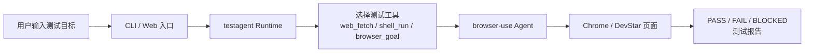

| 路线               | 常见方案                           | 核心特点                         | 更适合                  |
| ---------------- | ------------------------------ | ---------------------------- | -------------------- |
| 代码生成型 E2E        | 固定场景                           | Playwright/Appium 或平台测试资产    | CI 回归、团队协作、稳定执行      |
| 自然语言浏览器框架        | 介于 agent 和传统自动化之间              | 自然语言 + self-healing + 可和代码混用 | 想快速起量，又不想完全黑盒        |
| 视觉型 computer-use | 偏 AI agent 浏览器操作，适合“让模型自己去点网页” | 看截图、点/输/滚，像人一样操作页面           | 探索性测试、复杂跨站流程、流程录制/复现 |
| 通用 agent runtime | OpenClaw不单纯局限于测试场景             | 自托管 agent 网关，带浏览器/系统控制能力     | agent 平台             |

| 方案                                           | 当前实现状态                       |
| -------------------------------------------- | ---------------------------- |
| `testAgent + browser-use`                    | 可运行的 DevStar AI 工具           |
| `OpenClaw + coding-agent skill + Playwright` | 已验证代表场景 23 个 Playwright spec |

---

## 2. 方案一：`testAgent + browser-use`

在 testAgent 里，runtime 不会所有任务都强行走真实浏览器，而是先选工具。  
如果只是看页面内容，就走 web_fetch；  
如果要先查环境和日志，就走 shell_run；  
只有真正需要登录、点击、输入、提交这种交互动作时，才走 browser_goal。  
这样做的好处是，轻任务更快，重任务才用浏览器，整体效率和稳定性会更好。

### 2.4 安装、部署、配置

| 维度            | 方式                                                                                                                                                                                |
| ------------- | --------------------------------------------------------------------------------------------------------------------------------------------------------------------------------- |
| 安装            | `./install.sh`                                                                                                                                                                    |
| 本地 DevStar 准备 | `./devstar-bootstrap.sh ensure`测试前置条件 + `./devstar-local.sh up`启动本地devstar服务                                                                                                      |
| 环境检查          | `./qa-all.sh --doctor`做环境体检                                                                                                                                                       |
| CLI 使用        | `./qa-all.sh --goal "..."`跑临时自然语言测试目标/ `./qa-all.sh --test ...` 跑一条已经定义好的正式测试场景**/ `./qa-all.sh --suite ...`整组测试                                                                  |
| Web 使用        | `./openclaw-gateway.sh`Web 测试网关                                                                                                                                                   |
| 关键配置          | `DEVSTAR_BASE_URL`、`DEVSTAR_USERNAME`、`DEVSTAR_PASSWORD`、`DEVSTAR_OWNER`、`DEVSTAR_TOKEN`、`DEVSTAR_AI_QA_OPENAI_BASE_URL`、`DEVSTAR_AI_QA_OPENAI_API_KEY`、`DEVSTAR_AI_QA_LLM_MODEL` |
1. 如果 DEVSTAR_SOURCE_ROOT 不存在，则按 DEVSTAR_SOURCE_REPO_URL 自动 clone 源码
2. 如果缺少 gitea 二进制，则自动 build
3. 如果缺少 custom/conf/app.ini，则自动生成最小配置
4. 自动执行数据库迁移
5. 自动创建或修正本地管理员账号
6. 如果没有 DEVSTAR_TOKEN，则自动生成并回写
### 2.5 当前真实结果

| 项目     | 结果                               |
| ------ | -------------------------------- |
| 正式回归基线 | 23 场景中完整跑通，排除非devstar能力问题的fail场景 |

---

## 3. 方案二：`OpenClaw + coding-agent skill + Playwright`

### 3.1 方案定位

**OpenClaw 生成 Playwright 测试，最终由 Playwright 做确定性执行。**

### 3.4 核心文件
- 代表场景报告：[playwright-test-report-platform-access-ready.md](/Users/gaozhiyang/dev-docs/openTest/testAgent/playwright-test-report-platform-access-ready.md)
- Playwright 资产目录：[playwright-tests](/Users/gaozhiyang/dev-docs/openTest/testAgent/playwright-tests)
- 配置文件：[playwright.config.ts](/Users/gaozhiyang/dev-docs/openTest/testAgent/playwright-tests/playwright.config.ts)
- 依赖文件：[package.json](/Users/gaozhiyang/dev-docs/openTest/testAgent/playwright-tests/package.json)
- 示例用例：[platform-access.spec.ts](/Users/gaozhiyang/dev-docs/openTest/testAgent/playwright-tests/platform-access.spec.ts)

### 3.5 安装、部署、配置

| 维度    | 方式                                                             |
| ----- | -------------------------------------------------------------- |
| 安装依赖  | `npm install`                                                  |
| 安装浏览器 | `npx playwright install chromium`                              |
| 执行测试  | `npx playwright test`                                          |
| 核心配置  | `baseURL`、`trace`、`screenshot`、`video`、timeout、browser project |
| 部署方式  | 本地开发机 / CI Runner / 团队共享仓库                                     |

