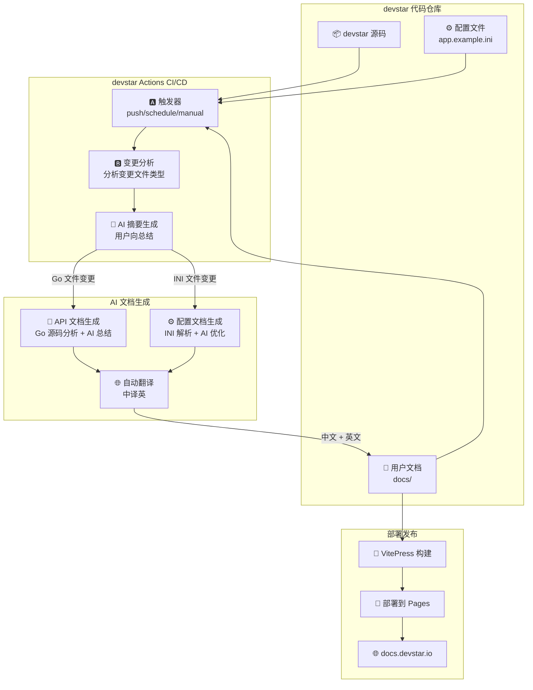
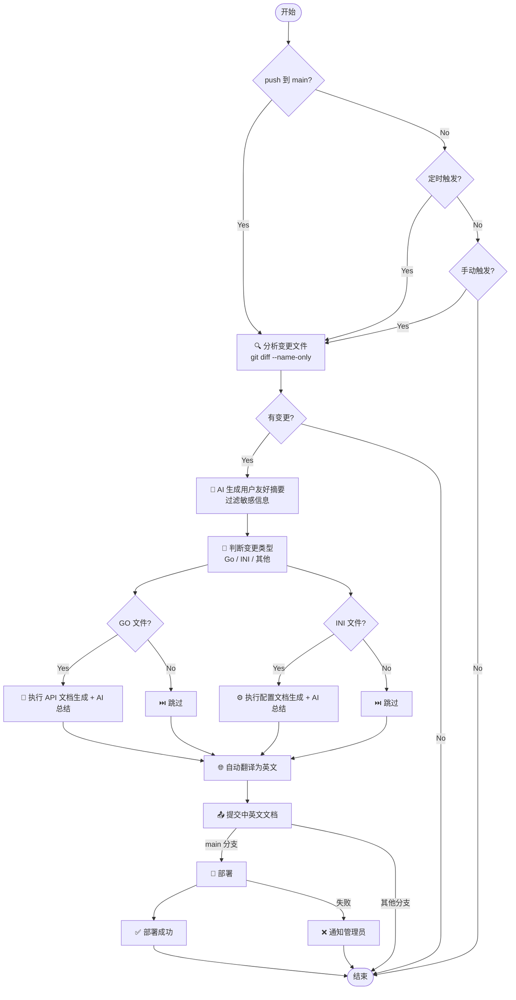
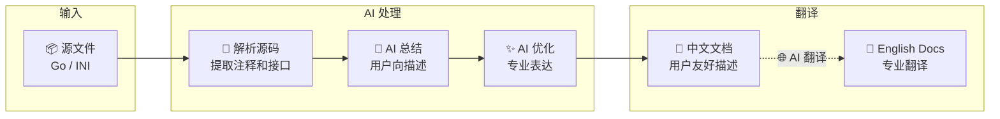
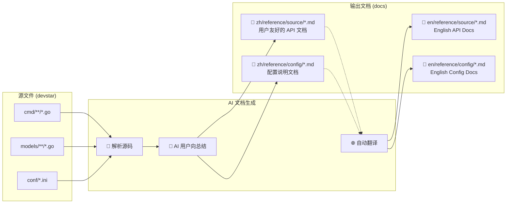
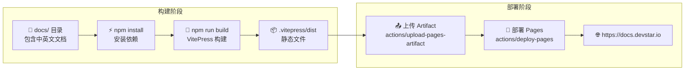
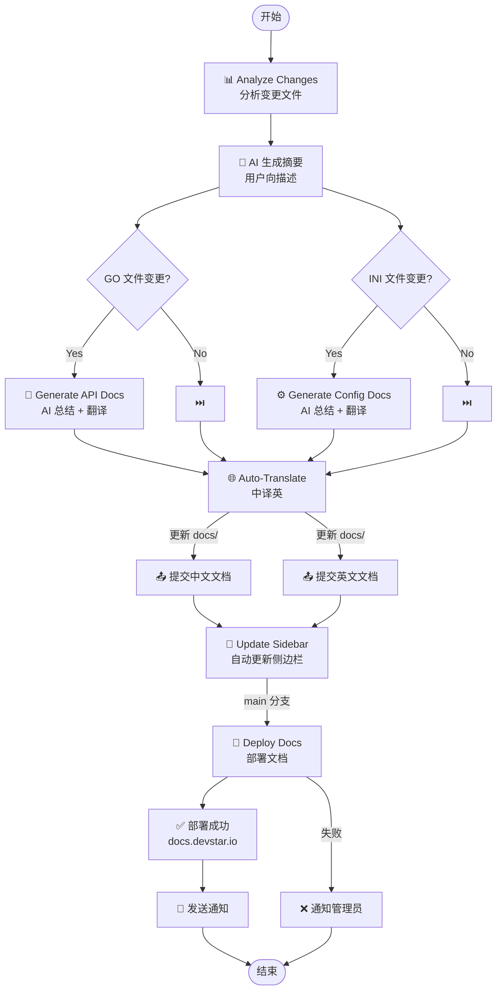

# DevStar Actions 工作流图示

  

> 本文档展示 devstar Actions 的 CI/CD 工作流程，用于自动更新用户文档。

  

---

  

## 🌐 整体架构图

  



  

---

  

## 📋 触发条件流程图

  



  

---

  

## 🔄 AI 文档生成流程图

  



  

---

  

## 🌐 自动翻译流程图

  

```mermaid

flowchart TD

NEW_DOC["📄 新生成的文档<br/>docs/zh/*.md"]

NEW_DOC -->|"检测新文件"| CHECK{"已有英文版?}

CHECK -->|No| TRANSLATE["🌐 调用 AI 翻译"]

CHECK -->|Yes| SKIP[⏭️ 跳过]

TRANSLATE --> SELECT["🤖 选择 AI 模型<br/>GPT-4 / GLM-4"]

SELECT --> PROMPT["📝 构建翻译 Prompt<br/>保持术语一致性"]

PROMPT --> EXECUTE["⚡ 执行翻译"]

EXECUTE --> OUTPUT["📄 生成英文文档<br/>docs/en/*.md"]

OUTPUT -->|"格式优化"| FORMAT["📋 格式化<br/>Markdown 格式"]

FORMAT --> DONE[✅ 完成]

SKIP --> DONE

```

  

---

  

## 🤖 AI Prompt 示例

  

### 1️⃣ 用户友好摘要生成

  

```markdown

请用简洁的中文，总结以下代码变更的用户影响。

  

变更的文件:

- cmd/web/main.go

- modules/auth/login.go

  

变更详情（摘录）:

... (diff 内容)

  

请用 1-2 句话总结这次更新对用户的影响，使用友好的语气。

例如: "新增了 XXX 功能，优化了 XXX 体验" 或 "修复了 XXX 问题，提升了稳定性"

不要提及具体的代码实现细节。

```

  

**AI 输出示例:**

> "✅ 新增了第三方 OAuth 登录支持，现在用户可以使用 GitHub、Google 账号快速登录。"

> "✅ 优化了 CI/CD Pipeline 的构建速度，平均节省 30% 构建时间。"

  

---

  

### 2️⃣ 文档翻译 (中译英)

  

```markdown

请将以下中文技术文档翻译为英文。

  

要求：

1. 保持 Markdown 格式

2. 保持代码块不变

3. 技术术语首次出现时在括号中给出中文解释

4. 语气正式、专业

5. 标题使用 Title Case

  

原文：

# 用户认证

用户认证是系统的核心功能...

```

  

**AI 输出示例:**

```markdown

# User Authentication

  

User authentication is the core functionality of the system. The platform supports multiple authentication methods:

  

- **Username/Password**: Traditional username and password authentication

- **OAuth 2.0**: Third-party OAuth 2.0 authentication (支持 GitHub, Google, etc.)

- **LDAP**: Enterprise LDAP/AD integration (企业级轻量目录访问协议)

```

  

---

  

## 📁 文档路径映射图

  



  

---

  

## 🚀 部署流程图

  



  

---

  

## 📋 工作流任务依赖图

  



  

---

  

## 🔧 配置项说明

  

### 环境变量

  

| 变量名 | 说明 | 必填 |

|-------|------|------|

| `OPENAI_API_KEY` | OpenAI API Key | 可选 |

| `ZHIPU_API_KEY` | 智谱 AI API Key | 可选 |

| `AI_PROVIDER` | AI 提供商 (`openai` / `zhipu`) | 可选 |

| `AI_MODEL` | AI 模型 (`gpt-4` / `glm-4`) | 可选 |

  

### Secrets 配置

  

| Secret | 说明 |

|--------|------|

| `OPENAI_API_KEY` | OpenAI API Key |

| `ZHIPU_API_KEY` | 智谱 AI API Key |

| `SMTP_SERVER` | SMTP 服务器（邮件通知） |

  

---

  

## 📊 过滤规则

  

### AI 摘要生成时过滤敏感文件

  

```python

sensitive_patterns = [

'test', # 测试文件

'fixtures', # 测试数据

'migrations' # 数据库迁移

]

  

user_docs = [f for f in files if not any(p in f.lower() for p in sensitive_patterns)]

```

  

### 只处理用户相关文档

  

| 文件类型 | 处理方式 |

|---------|---------|

| `cmd/**/*.go` | ✅ 生成 API 文档 |

| `models/**/*.go` | ✅ 生成数据模型文档 |

| `conf/*.ini` | ✅ 生成配置文档 |

| `tests/**/*.go` | ❌ 跳过 |

| `fixtures/**` | ❌ 跳过 |

  

---

  

*最后更新: 2026-02-04*