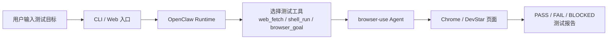

# 第 1 页：当前实现与结果
| 路线               | 常见方案                           | 核心特点                                                   | 更适合                  |
| ---------------- | ------------------------------ | ------------------------------------------------------ | -------------------- |
| 代码生成型 E2E        | 固定场景                           | AI 负责 map flow、生成/维护测试，但最终落到 Playwright/Appium 或平台测试资产 | CI 回归、团队协作、稳定执行      |
| 自然语言浏览器框架        | 介于 agent 和传统自动化之间              | 自然语言 + self-healing + 可和代码混用                           | 想快速起量，又不想完全黑盒        |
| 视觉型 computer-use | 偏 AI agent 浏览器操作，适合“让模型自己去点网页” | 看截图、点/输/滚，像人一样操作页面                                     | 探索性测试、复杂跨站流程、流程录制/复现 |
| 通用 agent runtime | OpenClaw不单纯局限于测试场景             | 自托管 agent 网关，带浏览器/系统控制能力                               | agent 平台             |

| 方案                                           | 核心定位           | 当前实现状态                            |
| -------------------------------------------- | -------------- | --------------------------------- |
| `testAgent + browser-use`                    | AI 直接参与运行时测试   | 已做成可运行的 DevStar AI 工具             |
| `OpenClaw + coding-agent skill + Playwright` | AI 生成和维护标准测试资产 | 已验证代表场景，并沉淀出 23 个 Playwright spec |

---

## 2. 方案一：`testAgent + browser-use`

### 2.1 方案定位
这条线不是单纯浏览器脚本，而是一套面向 DevStar 的 AI 自动化测试运行时。  
它把自然语言测试、固定测试、真实浏览器执行、本地环境准备、测试报告统一到了一个测试内核里。

### 2.2 架构



### 2.3 核心代码位置
- CLI 入口：[cli.py](/Users/gaozhiyang/dev-docs/openTest/testAgent/devstar_ai_qa/cli.py)
- 测试服务层：[testing_service.py](/Users/gaozhiyang/dev-docs/openTest/testAgent/devstar_ai_qa/testing_service.py)
- Runtime 编排层：[gateway_runtime.py](/Users/gaozhiyang/dev-docs/openTest/testAgent/devstar_ai_qa/gateway_runtime.py)
- 浏览器执行层：[goal_browser.py](/Users/gaozhiyang/dev-docs/openTest/testAgent/devstar_ai_qa/goal_browser.py)
- browser-use 封装：[browser_use_cli.py](/Users/gaozhiyang/dev-docs/openTest/testAgent/devstar_ai_qa/browser_use_cli.py)
- 使用说明：[README.md](/Users/gaozhiyang/dev-docs/openTest/testAgent/README.md)

### 2.4 安装、部署、配置

| 维度            | 方式                                                                                                                                                                                |
| ------------- | --------------------------------------------------------------------------------------------------------------------------------------------------------------------------------- |
| 安装            | `./install.sh`                                                                                                                                                                    |
| 本地 DevStar 准备 | `./devstar-bootstrap.sh ensure` + `./devstar-local.sh up`                                                                                                                         |
| 环境检查          | `./qa-all.sh --doctor`                                                                                                                                                            |
| CLI 使用        | `./qa-all.sh --goal "..."` / `./qa-all.sh --test ...` / `./qa-all.sh --suite ...`                                                                                                 |
| Web 使用        | `./openclaw-gateway.sh`                                                                                                                                                           |
| 关键配置          | `DEVSTAR_BASE_URL`、`DEVSTAR_USERNAME`、`DEVSTAR_PASSWORD`、`DEVSTAR_OWNER`、`DEVSTAR_TOKEN`、`DEVSTAR_AI_QA_OPENAI_BASE_URL`、`DEVSTAR_AI_QA_OPENAI_API_KEY`、`DEVSTAR_AI_QA_LLM_MODEL` |

### 2.5 当前真实结果

| 项目 | 结果 |
|---|---|
| 正式回归基线 | 2026-03-24 官方整包回归：23 场景中 **17 PASS / 6 FAIL** |
| 后续修复结果 | 剩余 6 条失败场景已继续修复，并逐条复跑 PASS |
| 当前更准确口径 | DevStar 23 个核心场景主链路已基本跑通，剩余工作主要是刷新新的整包 summary |

### 2.6 结果证据
- 官方整包回归 summary：[summary.md](/Users/gaozhiyang/dev-docs/openTest/testAgent/artifacts/suite-internal-regression-20260324T170448Z/summary.md)
- 最新问题定位与修复总结：[DevStar 23场景执行总结与问题定位.md](/Users/gaozhiyang/projects/ObsidianProjects/Obsidian/ai自动化测试/DevStar%2023场景执行总结与问题定位.md)

### 2.7 这条路线的价值
- 能直接跑真实业务流：登录、建仓、提 PR、开 IDE
- 适合探索式测试和临时验收
- 适合产品演示、现场验证、客户环境验证
- 适合页面刚改完、还没沉淀稳定脚本的时候

---

## 3. 方案二：`OpenClaw + coding-agent skill + Playwright`

### 3.1 方案定位
这条线的核心不是 AI 直接点页面，而是：

**让 OpenClaw / coding-agent 帮我生成、维护和组织 Playwright 测试资产，最终由 Playwright 做确定性执行。**

### 3.2 架构

```text
测试目标
-> OpenClaw / coding-agent skill
-> 生成或更新 Playwright 测试代码
-> npm install
-> npx playwright install chromium
-> npx playwright test
-> 标准 Playwright 报告
```

### 3.3 当前落地成果

| 项目 | 结果 |
|---|---|
| 代表场景 | `platform-access-ready` 已确认 PASS |
| 标准资产 | 已生成 23 个 DevStar 场景对应的 Playwright spec |
| 当前价值 | 已验证 AI 生成 Playwright 资产这条路线可行 |

### 3.4 核心文件
- 代表场景报告：[playwright-test-report-platform-access-ready.md](/Users/gaozhiyang/dev-docs/openTest/testAgent/playwright-test-report-platform-access-ready.md)
- Playwright 资产目录：[playwright-tests](/Users/gaozhiyang/dev-docs/openTest/testAgent/playwright-tests)
- 配置文件：[playwright.config.ts](/Users/gaozhiyang/dev-docs/openTest/testAgent/playwright-tests/playwright.config.ts)
- 依赖文件：[package.json](/Users/gaozhiyang/dev-docs/openTest/testAgent/playwright-tests/package.json)
- 示例用例：[platform-access.spec.ts](/Users/gaozhiyang/dev-docs/openTest/testAgent/playwright-tests/platform-access.spec.ts)

### 3.5 安装、部署、配置

| 维度 | 方式 |
|---|---|
| 安装依赖 | `npm install` |
| 安装浏览器 | `npx playwright install chromium` |
| 执行测试 | `npx playwright test` |
| 核心配置 | `baseURL`、`trace`、`screenshot`、`video`、timeout、browser project |
| 部署方式 | 本地开发机 / CI Runner / 团队共享仓库 |

### 3.6 这条路线的价值
- 更标准化
- 更容易接 CI
- 更适合代码评审、版本管理、长期维护
- 更适合把已验证通过的场景沉淀成长期回归资产

---

## 4. 两条路线的关系

| 维度 | `testAgent + browser-use` | `OpenClaw + coding-agent + Playwright` |
|---|---|---|
| 核心优势 | 灵活、泛化强、能跑复杂真实流程 | 稳定、可维护、适合回归和 CI |
| 适合阶段 | 场景探索、临时验证、真实业务验收 | 场景固化、持续回归、团队协作 |
| 最佳角色 | AI 测试执行器 | AI 测试资产生成器 |

### 当前最合适的结论
不是二选一，而是组合使用：
- 先用 `testAgent + browser-use` 把场景跑通
- 再用 `OpenClaw + Playwright` 把稳定场景沉淀成标准测试资产

---

---

# 第 2 页：行业对比与选型建议

## 1. 行业内常见 AI 自动测试方案

| 类型 | 代表方案 | 核心思路 | 更适合什么场景 |
|---|---|---|---|
| 代码生成型 E2E | QA Wolf、KaneAI、mabl、Functionize、Testim | AI 帮生成/维护测试代码或测试步骤，最终还是落到 Playwright / Appium / 平台资产 | CI 回归、团队协作、稳定执行 |
| 自然语言浏览器框架 | Stagehand、Momentic | 自然语言驱动浏览器，强调 self-healing、低门槛和可维护性 | 想快速起量，但不想完全黑盒 |
| 视觉型 computer-use | browser-use、OpenAI Computer Use | 看截图、点、输、滚，像人一样操作页面 | 探索式测试、复杂跨站流程、真实业务链路 |
| Playwright / DOM Agent 型 | Playwright Agents、Playwright Locators | 基于 DOM / locator / role 做更确定的测试执行和 agent 辅助 | 工程化自动化、IDE 调试、稳定资产 |
| 通用 agent runtime | OpenClaw、Browserbase MCP 等 | 把浏览器、shell、网页读取统一成 agent runtime | 平台化、统一入口、服务化共享 |
| 视觉验证平台 | Applitools | 用视觉 AI 做 UI 对比、视觉回归、界面一致性验证 | 视觉回归、跨浏览器 UI 检查 |

---

## 2. 你的两条方案在行业里分别落在哪

| 你的方案 | 行业归类 | 最像哪一类 |
|---|---|---|
| `testAgent + browser-use` | 视觉型 computer-use + agent runtime 混合 | `browser-use` + OpenClaw 风格 runtime |
| `OpenClaw + coding-agent skill + Playwright` | 代码生成型 E2E + Playwright agent 路线 | QA Wolf / KaneAI / mabl / Playwright Agents |

---

## 3. 行业对比下，我们这两条路线的价值

| 问题 | 更适合哪条路线 | 原因 |
|---|---|---|
| 新场景刚出来，没人写过脚本 | `testAgent + browser-use` | 不需要先写代码，直接自然语言验证 |
| 真实用户流很长，比如登录、建仓、提 PR | `testAgent + browser-use` | 更适合复杂真实交互 |
| 场景已经稳定，准备长期回归 | `OpenClaw + Playwright` | Playwright 更确定、更适合 CI |
| 想沉淀团队可维护资产 | `OpenClaw + Playwright` | 有代码、有配置、有版本管理 |
| 想做演示或快速验收 | `testAgent + browser-use` | 现场灵活度更高 |
| 想做 nightly regression / pre-release gate | `OpenClaw + Playwright` | 更适合持续执行和稳定门禁 |

---

## 4. 当前阶段最推荐的选型建议

### 短期
**主推 `testAgent + browser-use`**
- 先把核心业务链路跑通
- 先验证哪些场景值得做自动化
- 先解决探索式测试和现场验收问题

### 中期
**把高频稳定场景逐步转成 `OpenClaw + Playwright` 资产**
- 登录
- 建仓
- PR 创建
- DevContainer
- Workflow
- MCP / IDE 可见性

### 长期
形成“双轨制测试体系”：
1. AI 运行时测试  
   负责探索、验收、复杂真实链路  
2. 标准 Playwright 回归测试  
   负责稳定回归、CI、团队协作

---

## 5. 最终汇报结论

### 一句话版本
**我已经实现了两种 AI 自动化测试方案：**
- 一种偏 AI 直接执行测试
- 一种偏 AI 生成和维护测试资产

### 更完整的版本
- `testAgent + browser-use` 已经证明：AI 可以直接参与 DevStar 的真实业务流测试，当前已经覆盖 23 个核心测试场景，并把主链路基本跑通。
- `OpenClaw + coding-agent skill + Playwright` 已经证明：AI 不只是能直接测页面，也能把测试能力沉淀成标准 Playwright 资产，适合后续接入 CI 和长期维护。
- 这两条路线不是互斥关系，而是前后衔接关系：**前者负责跑通，后者负责沉淀。**

---

## 6. 参考链接
- [QA Wolf](https://www.qawolf.com/automation-ai)
- [KaneAI](https://www.testmuai.com/kane-ai/)
- [mabl](https://www.mabl.com/ai-test-automation)
- [Momentic](https://momentic.ai/)
- [browser-use](https://docs.browser-use.com/cloud/introduction)
- [OpenAI Computer Use](https://developers.openai.com/api/docs/guides/tools-computer-use)
- [Stagehand / Browserbase](https://www.browserbase.com/changelog/announcing-stagehand)
- [Browserbase MCP](https://docs.browserbase.com/integrations/mcp/introduction)
- [Playwright Agents](https://playwright.dev/docs/test-agents)
- [Playwright Locators](https://playwright.dev/docs/locators)
- [Applitools](https://applitools.com/)
