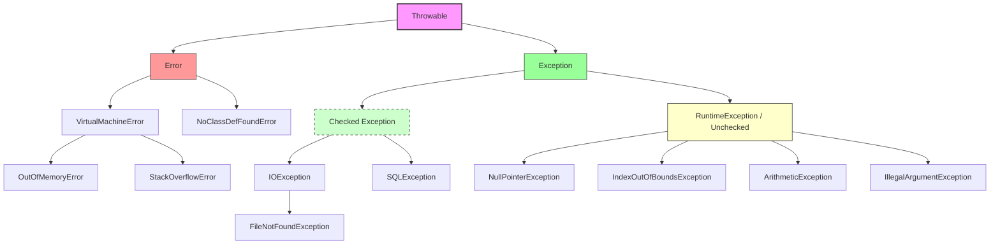

```mermaid
graph TD
    A[Throwable] --> B[Error]
    A --> C[Exception]

    %% Error 分支
    B --> B1[VirtualMachineError]
    B1 --> B1a[OutOfMemoryError]
    B1 --> B1b[StackOverflowError]
    B2[NoClassDefFoundError]
    B --> B2

    %% Exception 分支
    C --> D[Checked Exception]
    C --> E[RuntimeException / Unchecked]

    %% Checked Exception 示例
    D --> D1[IOException]
    D --> D2[SQLException]
    D1 --> D1a[FileNotFoundException]

    %% RuntimeException 示例
    E --> E1[NullPointerException]
    E --> E2[IndexOutOfBoundsException]
    E --> E3[ArithmeticException]
    E --> E4[IllegalArgumentException]

    %% 样式区分
    style A fill:#f9f,stroke:#333,stroke-width:2px
    style B fill:#ff9999,stroke:#333
    style C fill:#99ff99,stroke:#333
    style D fill:#ccffcc,stroke:#333,stroke-dasharray: 5 5
    style E fill:#ffffcc,stroke:#333
```

git clone https://github.com/op7418/guizang-ppt-skill.git ~/.codex/skills/guizang-ppt-skill